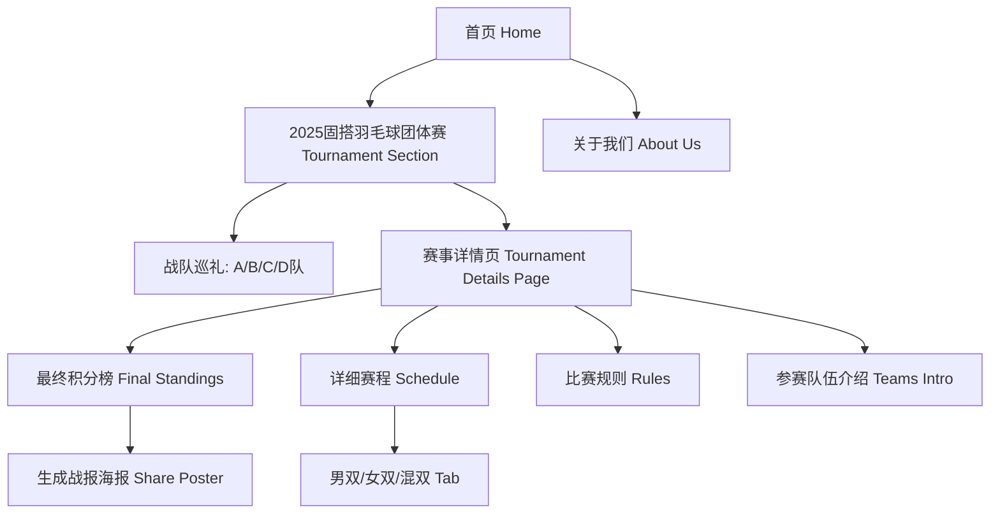

# 固搭羽毛球俱乐部 (GuDa Badminton Club) - 官网产品需求文档 (PRD)

| 文档版本 | 修改日期 | 修改人 | 备注 |
| :--- | :--- | :--- | :--- |
| v1.6 | 2025-12-11 | AI Assistant | 细化赛事详情页赛程展示逻辑，增加海报分享功能 |

## 目录 (Table of Contents)

1.  [项目概述 (Project Overview)](#1-项目概述-project-overview)
2.  [设计语言与规范 (Design System)](#2-设计语言与规范-design-system)
3.  [信息架构 (Information Architecture)](#3-信息架构-information-architecture)
4.  [核心业务流程 (User Flows)](#4-核心业务流程-user-flows)
5.  [页面详细功能需求 (Page Requirements)](#5-页面详细功能需求-page-requirements)
    *   [5.1 首页 (Home)](#51-首页-home)
    *   [5.2 赛事详情页 (Tournament Details)](#52-赛事详情页-tournament-details)
    *   [5.3 关于我们 (About Us)](#53-关于我们-about-us)
6.  [非功能性需求 (Non-Functional Requirements)](#6-非功能性需求-non-functional-requirements)

---

## 1. 项目概述 (Project Overview)

### 1.1 项目背景
固搭羽毛球俱乐部旨在为羽毛球爱好者提供一个高端、专业的运动社交平台。当前“2025固搭羽毛球团体赛”正在火热进行中，网站需作为赛事的官方信息发布窗口。

### 1.2 项目目标
*   **赛事聚焦**：全力配合“2025固搭羽毛球团体赛”，通过官网展示4支战队的阵容与实力。
*   **深度内容**：提供独立的赛事详情页，展示最终积分榜、单项详细赛程、比赛规则及**参赛队伍风采**，并提供**战报海报生成**功能。
*   **体验优化**：首页至赛事模块的平滑滚动，以及清晰、精致的二级页面跳转入口。

---

## 2. 设计语言与规范 (Design System)

### 2.1 视觉风格 (Visual Style)
*   **关键词**：未来感 (Futuristic)、沉浸式 (Immersive)、质感 (Texture)、极简 (Minimalist)。
*   **主色调**：
    *   **暗夜黑 (Dark Mode Base)**: `#0F1115` (用于背景，营造高端深邃感)
    *   **羽毛白 (Text/Accent)**: `#FFFFFF` (主要文字)
    *   **深海科技蓝 (Brand Accent)**: `#2563EB` to `#60A5FA` (主行动点，强调冷静、专业与速度感)
    *   **活力青 (Secondary Accent)**: `#10B981` (强调胜负、数据)
*   **积分榜特效**：
    *   **冠军**：金色渐变背景 + 金色徽章 + 光晕特效
    *   **亚军**：银色风格
    *   **季军**：铜色风格

### 2.2 字体规范 (Typography)
*   中文字体：PingFang SC, Microsoft YaHei, Sans-serif
*   英文字体：Inter, Roboto, Sans-serif (用于比分和标语，强调现代感)
*   **比分展示**：胜方分数采用高亮粗体，负方灰色，字号保持一致。

### 2.3 交互动效 (Interactions)
*   **Smooth Scroll**: 首页点击“火热进行中”按钮时，需平滑滚动至赛事模块，禁止瞬切。
*   **Page Transition**: 进入二级页面时采用轻微的淡入效果。
*   **Button Hover**: “赛事详情”按钮采用更精致的边框流光或发光效果。
*   **Share Modal**: 点击生成海报时，弹窗平滑淡入，生成过程显示加载状态。

---

## 3. 信息架构 (Information Architecture)



---

## 4. 核心业务流程 (User Flows)

### 4.1 查看赛事详情流程

```mermaid
sequenceDiagram
    participant User as 用户
    participant Home as 首页
    participant Details as 赛事详情页
    
    User->>Home: 点击Hero区“火热进行中”
    Home-->>User: 平滑滚动至“团体赛模块”
    User->>Home: 浏览战队信息，点击“查看赛事详情”
    Home->>Details: 跳转至二级页面
    Details-->>User: 展示积分榜、单项赛程、规则及战队介绍
    User->>Details: 点击“生成战报海报”
    Details->>User: 弹出选择队伍模态框
    User->>Details: 选择队伍
    Details->>User: 生成并展示高清战报图片
    User->>Details: 点击“返回首页”
    Details->>Home: 返回首页
```

---

## 5. 页面详细功能需求 (Page Requirements)

### 5.1 首页 (Home)

| 模块 | 功能描述 | 交互细节 (High-Fidelity Specs) |
| :--- | :--- | :--- |
| **Hero Section** | 核心入口按钮文案：“🔥 2025固搭羽毛球团体赛火热进行中 🏸”。 | **点击按钮平滑滚动 (Smooth Scroll)** 至页面中部的赛事模块。 |
| **Tournament Section** | 展示4支战队卡片。**移除**原本的赛制标签按钮。**右上角优化“赛事详情”入口**。 | “赛事详情”按钮需设计得更具质感（如细边框、微发光、图标引导）。 |

### 5.2 赛事详情页 (Tournament Details)

*   **页面布局**：保持与首页一致的暗黑科技蓝风格。
*   **Hero Banner**：展示赛事Logo或主视觉，标题“2025固搭羽毛球团体赛 - 赛事中心”。
*   **核心模块**：
    1.  **最终积分榜 (Final Standings)**：
        *   展示4支队伍的最终排名、场次、胜负关系、净胜分、积分。
        *   前三名（冠亚季军）需有特殊的视觉强调（金/银/铜徽章及高亮背景）。
        *   **海报分享**：标题栏右侧增加“生成战报海报”按钮，点击后支持选择队伍生成含二维码的战报图片。
    2.  **详细赛程 (Schedule)**：
        *   **Tab分类**：按单项分类（男双、女双、混双），而非按轮次。
        *   **比分展示**：紧凑型表格布局，展示每一场对局的详细比分（三局两胜）。
        *   **视觉优化**：获胜方比分高亮加粗，字体大小统一，易于阅读。
    3.  **比赛规则 (Rules)**：
        *   简要展示核心规则。
        *   标题栏右侧增加“详细规则”跳转入口（低调样式）。
    4.  **参赛队伍 (Teams)**：
        *   在页面底部区域，详细展示4支战队的完整队员名单（7人全展示，不折叠）。
        *   移除英文队名，保持纯中文展示。

### 5.3 关于我们 & 底部

*   保持原有设计，Footer 包含 "Powered by Jalen"。

---

## 6. 非功能性需求 (Non-Functional Requirements)

1.  **滚动体验**：确保所有锚点跳转均为平滑滚动。
2.  **响应式**：详情页表格在移动端需支持横向滚动，比分列需在小屏幕下保持整齐。
3.  **性能**：海报生成需在客户端完成（使用 html2canvas），避免过度消耗服务器资源，生成速度需控制在 1s 以内。
