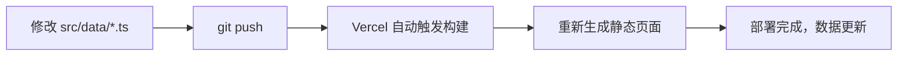

# 固搭羽毛球俱乐部官网 - 技术设计文档

| 文档版本 | 修改日期 | 修改人 | 备注 |
| :--- | :--- | :--- | :--- |
| v1.0 | 2025-12-11 | AI Assistant | 初稿，定义技术栈、架构设计与数据结构 |
| v1.1 | 2025-12-11 | AI Assistant | 完善数据结构（战队Logo、比赛层级），更新部署方案（静态托管） |

---

## 目录

1. [技术栈选型](#1-技术栈选型)
2. [项目架构设计](#2-项目架构设计)
3. [目录结构](#3-目录结构)
4. [数据结构设计](#4-数据结构设计)
5. [组件设计](#5-组件设计)
6. [路由设计](#6-路由设计)
7. [部署方案](#7-部署方案)

---

## 1. 技术栈选型

### 1.1 核心技术栈

| 类别 | 技术 | 版本 | 说明 |
| :--- | :--- | :--- | :--- |
| **框架** | Next.js | 14.x | React 全栈框架，支持 SSG 静态生成 |
| **语言** | TypeScript | 5.x | 类型安全，提升开发效率 |
| **样式** | Tailwind CSS | 3.x | 原子化 CSS，与原型保持一致 |
| **动画** | Framer Motion | 11.x | 流畅的页面过渡与微交互动效 |
| **图标** | Lucide React | latest | 轻量级 SVG 图标库 |
| **海报生成** | html2canvas | 1.x | 客户端生成战报海报图片 |
| **二维码** | qrcode.react | 3.x | React 二维码组件 |

### 1.2 开发工具链

| 类别 | 技术 | 说明 |
| :--- | :--- | :--- |
| **包管理** | pnpm | 高效的包管理工具 |
| **代码规范** | ESLint + Prettier | 代码风格统一 |
| **Git Hooks** | Husky + lint-staged | 提交前自动检查 |

### 1.3 选型理由

1. **Next.js 14**
   - App Router 提供更清晰的路由结构
   - 支持 SSG（静态站点生成），适合官网场景
   - 内置图片优化、字体优化
   - 易于部署至 Vercel

2. **TypeScript**
   - 数据结构复杂（战队、赛程、比分），类型系统可有效避免错误
   - 良好的 IDE 智能提示

3. **Tailwind CSS**
   - 与现有高保真原型使用的技术一致，迁移成本低
   - 原子化设计便于响应式布局

---

## 2. 项目架构设计

### 2.1 整体架构

```
┌─────────────────────────────────────────────────────────┐
│                     用户浏览器                           │
└───────────────────────┬─────────────────────────────────┘
                        │
                        ▼
┌─────────────────────────────────────────────────────────┐
│                   Vercel Edge CDN                        │
│                  (全球加速 & 缓存)                        │
└───────────────────────┬─────────────────────────────────┘
                        │
                        ▼
┌─────────────────────────────────────────────────────────┐
│              Next.js 静态站点 (SSG)                      │
│  ┌─────────────────────────────────────────────────┐    │
│  │                   App Router                     │    │
│  │  ┌──────────┐  ┌──────────┐  ┌──────────────┐   │    │
│  │  │  首页    │  │ 赛事详情 │  │   关于我们   │   │    │
│  │  │   /      │  │/tournament│  │    /about    │   │    │
│  │  └──────────┘  └──────────┘  └──────────────┘   │    │
│  └─────────────────────────────────────────────────┘    │
│                                                          │
│  ┌─────────────────────────────────────────────────┐    │
│  │              共享组件 & 数据层                    │    │
│  │  ┌──────────┐  ┌──────────┐  ┌──────────────┐   │    │
│  │  │Components│  │   Data   │  │    Utils     │   │    │
│  │  └──────────┘  └──────────┘  └──────────────┘   │    │
│  └─────────────────────────────────────────────────┘    │
└─────────────────────────────────────────────────────────┘
```

### 2.2 数据流设计

```
┌──────────────────┐      构建时读取      ┌──────────────────┐
│  data/*.ts       │  ──────────────────▶ │   Next.js 页面   │
│  (静态数据源)     │                      │   (SSG 预渲染)    │
└──────────────────┘                      └────────┬─────────┘
                                                   │
                                                   ▼ 客户端
┌──────────────────────────────────────────────────────────┐
│                      用户交互                             │
│  ┌──────────────┐   ┌──────────────┐   ┌──────────────┐  │
│  │  Tab 切换    │   │ 平滑滚动     │   │ 生成海报     │  │
│  │  (赛程分类)  │   │ (锚点跳转)   │   │ (html2canvas)│  │
│  └──────────────┘   └──────────────┘   └──────────────┘  │
└──────────────────────────────────────────────────────────┘
```

### 2.3 渲染策略

| 页面 | 渲染方式 | 说明 |
| :--- | :--- | :--- |
| 首页 `/` | SSG | 静态生成，CDN 缓存 |
| 赛事详情 `/tournament` | SSG | 静态生成，比赛数据在构建时注入 |
| 关于我们 `/about` | SSG | 静态生成 |

---

## 3. 目录结构

```
Web/
├── public/                     # 静态资源
│   ├── images/                 # 图片资源
│   │   ├── logo.svg           # 俱乐部 Logo
│   │   ├── hero-bg.jpg        # Hero 背景图（可选）
│   │   ├── qrcode-group.png   # 微信群二维码
│   │   └── teams/             # 战队 Logo 目录
│   │       ├── team-a-tiger.png   # 猛虎队 Logo
│   │       ├── team-b-eagle.png   # 雄鹰队 Logo
│   │       ├── team-c-leopard.png # 猎豹队 Logo
│   │       └── team-d-wolf.png    # 战狼队 Logo
│   └── fonts/                  # 自定义字体（可选）
│
├── src/
│   ├── app/                    # Next.js App Router
│   │   ├── layout.tsx         # 根布局（导航栏、Footer）
│   │   ├── page.tsx           # 首页
│   │   ├── tournament/
│   │   │   └── page.tsx       # 赛事详情页
│   │   ├── about/
│   │   │   └── page.tsx       # 关于我们
│   │   └── globals.css        # 全局样式
│   │
│   ├── components/             # React 组件
│   │   ├── layout/
│   │   │   ├── Navbar.tsx     # 导航栏
│   │   │   └── Footer.tsx     # 页脚
│   │   ├── home/
│   │   │   ├── HeroSection.tsx      # Hero 区域
│   │   │   ├── TournamentSection.tsx # 赛事模块
│   │   │   └── TeamCard.tsx         # 战队卡片
│   │   ├── tournament/
│   │   │   ├── StandingsTable.tsx   # 积分榜表格
│   │   │   ├── ScheduleTabs.tsx     # 赛程 Tab 切换
│   │   │   ├── MatchRow.tsx         # 单场比赛行
│   │   │   ├── RulesSection.tsx     # 规则模块
│   │   │   ├── TeamsGrid.tsx        # 战队网格
│   │   │   └── PosterModal.tsx      # 海报生成弹窗
│   │   └── ui/
│   │       ├── Button.tsx           # 按钮组件
│   │       ├── Badge.tsx            # 徽章组件
│   │       ├── RankBadge.tsx        # 排名徽章（金银铜）
│   │       └── SectionHeader.tsx    # 区块标题
│   │
│   ├── data/                   # 静态数据
│   │   ├── teams.ts           # 战队数据
│   │   ├── matches.ts         # 比赛数据
│   │   ├── standings.ts       # 积分榜数据
│   │   └── rules.ts           # 规则文案
│   │
│   ├── types/                  # TypeScript 类型定义
│   │   └── index.ts           # 统一导出类型
│   │
│   ├── utils/                  # 工具函数
│   │   ├── poster.ts          # 海报生成相关
│   │   └── scroll.ts          # 平滑滚动相关
│   │
│   └── styles/                 # 样式扩展
│       └── animations.css     # 自定义动画
│
├── tailwind.config.ts          # Tailwind 配置
├── next.config.js              # Next.js 配置
├── tsconfig.json               # TypeScript 配置
├── package.json                # 依赖管理
└── README.md                   # 项目说明
```

---

## 4. 数据结构设计

### 4.1 类型定义 (`src/types/index.ts`)

```typescript
// ============================================
// 战队相关类型
// ============================================

/** 战队标识 */
export type TeamId = 'A' | 'B' | 'C' | 'D';

/** 战队颜色主题 */
export interface TeamTheme {
  primary: string;      // 主色 Tailwind class, 如 'blue-600'
  gradient: string;     // 渐变背景 class
  shadow: string;       // 阴影颜色 class
  textAccent: string;   // 文字强调色 class, 如 'text-blue-400'
}

/** 战队信息 */
export interface Team {
  id: TeamId;
  name: string;           // 队名，如 "猛虎队"
  logo: string;           // 战队 Logo 图片路径，如 "/images/teams/team-a.png"
  captain: string;        // 队长姓名
  members: string[];      // 队员列表（不含队长）
  theme: TeamTheme;       // 颜色主题
}

// ============================================
// 比赛相关类型
// ============================================

/**
 * 比赛层级说明：
 * - 轮次 (Round): 单循环赛制共3轮，每轮2场团体对决
 * - 场次 (Match): 每场团体赛包含多个单项比赛
 * - 局次 (Game): 每个单项采用三局两胜制，局数为2或3
 * 
 * 示例：第1轮 → 猛虎队vs雄鹰队(团体赛) → 男双1(单项) → 第1局/第2局/第3局
 */

/** 单项类型 */
export type MatchCategory = 'MD' | 'WD' | 'XD';

/** 单项类型中文映射 */
export const MatchCategoryLabel: Record<MatchCategory, string> = {
  MD: '男双',  // Men's Doubles
  WD: '女双',  // Women's Doubles
  XD: '混双',  // Mixed Doubles
};

/** 单局比分（最小粒度） */
export interface GameScore {
  gameNumber: number;   // 局次序号：1, 2, 3
  scoreA: number;       // 甲方得分
  scoreB: number;       // 乙方得分
  winner: 'A' | 'B';    // 本局获胜方
}

/** 单项比赛（一场团体赛中的某个单项） */
export interface Match {
  id: string;                       // 唯一标识，格式: "R{轮次}-{单项}-{场序}"，如 "R1-MD-1"
  
  // === 层级信息 ===
  round: number;                    // 轮次：1, 2, 3
  category: MatchCategory;          // 单项类型：MD(男双) | WD(女双) | XD(混双)
  matchNumber: number;              // 该单项的场次序号：1, 2（每个单项每轮可能有多场）
  
  // === 对阵信息 ===
  teamA: TeamId;                    // 甲方战队
  teamB: TeamId;                    // 乙方战队
  playersA: string[];               // 甲方选手名单（2人）
  playersB: string[];               // 乙方选手名单（2人）
  
  // === 比分信息 ===
  games: GameScore[];               // 各局比分，长度为 2 或 3（三局两胜制）
  totalGamesPlayed: number;         // 总局数：2 或 3
  
  // === 结果信息 ===
  winner: TeamId | null;            // 获胜方（null 表示未开始）
  status: 'upcoming' | 'completed'; // 比赛状态
}

// ============================================
// 积分榜相关类型
// ============================================

/** 排名类型 */
export type RankType = 'champion' | 'runner-up' | 'third' | 'fourth';

/** 积分榜条目 */
export interface StandingEntry {
  rank: number;                   // 排名 1-4
  rankType: RankType;             // 排名类型（用于样式）
  team: TeamId;                   // 战队 ID
  played: number;                 // 已赛场次
  won: number;                    // 胜场
  lost: number;                   // 负场
  pointsDiff: number;             // 净胜分（正/负）
  points: number;                 // 总积分
}

// ============================================
// 海报相关类型
// ============================================

/** 海报数据 */
export interface PosterData {
  team: Team;
  standing: StandingEntry;
  qrCodeUrl: string;              // 二维码链接
}
```

### 4.2 战队数据示例 (`src/data/teams.ts`)

```typescript
import { Team } from '@/types';

export const teams: Record<string, Team> = {
  A: {
    id: 'A',
    name: '猛虎队',
    logo: '/images/teams/team-a-tiger.png',  // 战队 Logo
    captain: '张三丰',
    members: ['李四', '王五', '赵六', '孙七', '周八', '吴九'],
    theme: {
      primary: 'blue-600',
      gradient: 'from-blue-500 to-blue-700',
      shadow: 'shadow-blue-500/20',
      textAccent: 'text-blue-400',
    },
  },
  B: {
    id: 'B',
    name: '雄鹰队',
    logo: '/images/teams/team-b-eagle.png',
    captain: '风清扬',
    members: ['令狐冲', '岳灵珊', '林平之', '任盈盈', '向问天', '蓝凤凰'],
    theme: {
      primary: 'cyan-600',
      gradient: 'from-cyan-500 to-cyan-700',
      shadow: 'shadow-cyan-500/20',
      textAccent: 'text-cyan-400',
    },
  },
  C: {
    id: 'C',
    name: '猎豹队',
    logo: '/images/teams/team-c-leopard.png',
    captain: '杨过',
    members: ['小龙女', '郭芙', '郭襄', '耶律齐', '陆无双', '程英'],
    theme: {
      primary: 'purple-600',
      gradient: 'from-purple-500 to-purple-700',
      shadow: 'shadow-purple-500/20',
      textAccent: 'text-purple-400',
    },
  },
  D: {
    id: 'D',
    name: '战狼队',
    logo: '/images/teams/team-d-wolf.png',
    captain: '郭靖',
    members: ['黄蓉', '柯镇恶', '朱聪', '韩宝驹', '南希仁', '全金发'],
    theme: {
      primary: 'rose-600',
      gradient: 'from-rose-500 to-rose-700',
      shadow: 'shadow-rose-500/20',
      textAccent: 'text-rose-400',
    },
  },
};
```

### 4.3 比赛数据示例 (`src/data/matches.ts`)

```typescript
import { Match, MatchCategory } from '@/types';

export const matches: Match[] = [
  // ========================================
  // 第1轮 (Round 1)
  // 对阵：猛虎队(A) vs 雄鹰队(B)，猎豹队(C) vs 战狼队(D)
  // ========================================
  
  // --- 猛虎队 vs 雄鹰队：男双第1场 ---
  {
    id: 'R1-MD-1',
    // 层级信息
    round: 1,                       // 第1轮
    category: 'MD',                 // 男双
    matchNumber: 1,                 // 该单项第1场
    // 对阵信息
    teamA: 'A',
    teamB: 'B',
    playersA: ['张三', '李四'],
    playersB: ['令狐冲', '风清扬'],
    // 比分信息（三局两胜，打满3局）
    games: [
      { gameNumber: 1, scoreA: 21, scoreB: 19, winner: 'A' },  // 第1局：甲方胜
      { gameNumber: 2, scoreA: 18, scoreB: 21, winner: 'B' },  // 第2局：乙方胜
      { gameNumber: 3, scoreA: 21, scoreB: 15, winner: 'A' },  // 第3局：甲方胜
    ],
    totalGamesPlayed: 3,            // 总共打了3局
    // 结果
    winner: 'A',                    // 猛虎队获胜（2:1）
    status: 'completed',
  },
  
  // --- 猛虎队 vs 雄鹰队：男双第2场 ---
  {
    id: 'R1-MD-2',
    round: 1,
    category: 'MD',
    matchNumber: 2,                 // 该单项第2场
    teamA: 'A',
    teamB: 'B',
    playersA: ['孙七', '周八'],
    playersB: ['向问天', '计无施'],
    // 比分信息（两局结束，2:0速胜）
    games: [
      { gameNumber: 1, scoreA: 21, scoreB: 15, winner: 'A' },
      { gameNumber: 2, scoreA: 21, scoreB: 12, winner: 'A' },
    ],
    totalGamesPlayed: 2,            // 只打了2局
    winner: 'A',
    status: 'completed',
  },
  
  // --- 猛虎队 vs 雄鹰队：女双 ---
  {
    id: 'R1-WD-1',
    round: 1,
    category: 'WD',                 // 女双
    matchNumber: 1,
    teamA: 'A',
    teamB: 'B',
    playersA: ['王五', '赵六'],
    playersB: ['岳灵珊', '蓝凤凰'],
    games: [
      { gameNumber: 1, scoreA: 15, scoreB: 21, winner: 'B' },
      { gameNumber: 2, scoreA: 21, scoreB: 19, winner: 'A' },
      { gameNumber: 3, scoreA: 18, scoreB: 21, winner: 'B' },
    ],
    totalGamesPlayed: 3,
    winner: 'B',                    // 雄鹰队获胜
    status: 'completed',
  },
  
  // --- 猛虎队 vs 雄鹰队：混双 ---
  {
    id: 'R1-XD-1',
    round: 1,
    category: 'XD',                 // 混双
    matchNumber: 1,
    teamA: 'A',
    teamB: 'B',
    playersA: ['张三', '赵六'],
    playersB: ['令狐冲', '岳灵珊'],
    games: [
      { gameNumber: 1, scoreA: 18, scoreB: 21, winner: 'B' },
      { gameNumber: 2, scoreA: 19, scoreB: 21, winner: 'B' },
    ],
    totalGamesPlayed: 2,
    winner: 'B',
    status: 'completed',
  },
  
  // ... 更多比赛数据（第2轮、第3轮）
];

// ============================================
// 工具函数
// ============================================

/** 按单项类型筛选比赛 */
export function getMatchesByCategory(category: MatchCategory): Match[] {
  return matches.filter((m) => m.category === category);
}

/** 按轮次筛选比赛 */
export function getMatchesByRound(round: number): Match[] {
  return matches.filter((m) => m.round === round);
}

/** 获取某轮次某单项的所有比赛 */
export function getMatchesByRoundAndCategory(round: number, category: MatchCategory): Match[] {
  return matches.filter((m) => m.round === round && m.category === category);
}

/** 计算某场比赛的局比分（如 "2:1"） */
export function getGameScore(match: Match): { winsA: number; winsB: number } {
  const winsA = match.games.filter((g) => g.winner === 'A').length;
  const winsB = match.games.filter((g) => g.winner === 'B').length;
  return { winsA, winsB };
}
```

### 4.4 积分榜数据 (`src/data/standings.ts`)

```typescript
import { StandingEntry } from '@/types';

export const standings: StandingEntry[] = [
  {
    rank: 1,
    rankType: 'champion',
    team: 'A',
    played: 3,
    won: 3,
    lost: 0,
    pointsDiff: 18,
    points: 9,
  },
  {
    rank: 2,
    rankType: 'runner-up',
    team: 'B',
    played: 3,
    won: 2,
    lost: 1,
    pointsDiff: 8,
    points: 6,
  },
  {
    rank: 3,
    rankType: 'third',
    team: 'C',
    played: 3,
    won: 1,
    lost: 2,
    pointsDiff: -5,
    points: 3,
  },
  {
    rank: 4,
    rankType: 'fourth',
    team: 'D',
    played: 3,
    won: 0,
    lost: 3,
    pointsDiff: -21,
    points: 0,
  },
];
```

---

## 5. 组件设计

### 5.1 核心组件清单

| 组件名 | 路径 | 功能描述 |
| :--- | :--- | :--- |
| `Navbar` | `components/layout/Navbar.tsx` | 顶部导航栏，毛玻璃效果，固定定位 |
| `Footer` | `components/layout/Footer.tsx` | 页脚，包含二维码和版权信息 |
| `HeroSection` | `components/home/HeroSection.tsx` | 首页 Hero 区域，含 CTA 按钮 |
| `TournamentSection` | `components/home/TournamentSection.tsx` | 战队卡片网格 + 详情入口 |
| `TeamCard` | `components/home/TeamCard.tsx` | 单个战队卡片，悬停动效 |
| `StandingsTable` | `components/tournament/StandingsTable.tsx` | 积分榜表格，含排名徽章 |
| `ScheduleTabs` | `components/tournament/ScheduleTabs.tsx` | 赛程 Tab 切换容器 |
| `MatchRow` | `components/tournament/MatchRow.tsx` | 单场比赛信息行 |
| `PosterModal` | `components/tournament/PosterModal.tsx` | 海报生成弹窗 |
| `RankBadge` | `components/ui/RankBadge.tsx` | 排名徽章（1-4名不同样式） |

### 5.2 组件 Props 示例

```typescript
// TeamCard.tsx
interface TeamCardProps {
  team: Team;
  className?: string;
}

// StandingsTable.tsx
interface StandingsTableProps {
  standings: StandingEntry[];
  onGeneratePoster: () => void;
}

// MatchRow.tsx
interface MatchRowProps {
  match: Match;
  showRound?: boolean;
}

// RankBadge.tsx
interface RankBadgeProps {
  rank: number;
  size?: 'sm' | 'md' | 'lg';
}
```

---

## 6. 路由设计

| 路由 | 页面文件 | 描述 |
| :--- | :--- | :--- |
| `/` | `app/page.tsx` | 首页，含 Hero + 战队展示 |
| `/tournament` | `app/tournament/page.tsx` | 赛事详情页 |
| `/about` | `app/about/page.tsx` | 关于我们（可选） |

### 6.1 锚点跳转

首页内部模块使用锚点实现平滑滚动：

| 锚点 | 目标模块 |
| :--- | :--- |
| `#home` | Hero 区域 |
| `#tournament` | 赛事模块 |
| `#contact` | Footer 联系区域 |

---

## 7. 部署方案

### 7.1 部署需求分析

| 需求 | 说明 |
| :--- | :--- |
| **静态托管** | 类似 GitHub Pages，无需后端服务器 |
| **数据存储** | 数据文件放置在项目目录下，构建时读取 |
| **CDN 加速** | 全球访问速度快 |
| **免费/低成本** | 个人项目预算有限 |

### 7.2 平台对比

| 平台 | 静态托管 | 自定义域名 | CDN | CI/CD | 免费额度 | 推荐度 |
| :--- | :---: | :---: | :---: | :---: | :--- | :---: |
| **Vercel** | ✅ | ✅ 免费 | ✅ 全球 | ✅ 自动 | 100GB/月带宽 | ⭐⭐⭐⭐⭐ |
| GitHub Pages | ✅ | ✅ 免费 | ⚠️ 有限 | ⚠️ 需配置 | 无限（公开仓库） | ⭐⭐⭐ |
| Netlify | ✅ | ✅ 免费 | ✅ 全球 | ✅ 自动 | 100GB/月带宽 | ⭐⭐⭐⭐ |
| Cloudflare Pages | ✅ | ✅ 免费 | ✅ 全球 | ✅ 自动 | 无限带宽 | ⭐⭐⭐⭐ |

### 7.3 推荐方案：Vercel

**Vercel 完全满足静态页面部署需求**，且优势明显：

1. **原生支持 Next.js SSG（静态站点生成）**
   - 构建时将所有页面预渲染为纯静态 HTML
   - 数据文件（`src/data/*.ts`）在构建时读取并注入页面
   - 最终输出纯静态文件，无需任何服务器运行时

2. **部署后的文件结构**
   ```
   .vercel/output/static/
   ├── index.html              # 首页
   ├── tournament/
   │   └── index.html          # 赛事详情页
   ├── _next/
   │   └── static/             # JS/CSS 资源
   └── images/                  # 图片资源
   ```

3. **数据存储方式**
   - 所有数据以 TypeScript 文件形式存放在 `src/data/` 目录
   - 构建时（`next build`）读取数据并生成静态页面
   - **无需数据库、无需 API、无需后端服务**

### 7.4 静态导出配置

如果需要完全脱离 Vercel，生成纯静态文件部署到任意托管平台：

```javascript
// next.config.js
/** @type {import('next').NextConfig} */
const nextConfig = {
  output: 'export',  // 启用静态导出模式
  images: {
    unoptimized: true,  // 静态导出时禁用图片优化
  },
  trailingSlash: true,  // URL 末尾加斜杠，兼容静态托管
};

module.exports = nextConfig;
```

运行 `next build` 后，会在 `out/` 目录生成纯静态文件：

```
out/
├── index.html
├── tournament/
│   └── index.html
├── about/
│   └── index.html
├── _next/
│   ├── static/
│   │   ├── chunks/
│   │   └── css/
└── images/
```

这些文件可以直接上传到任何静态托管平台（GitHub Pages、Nginx、阿里云 OSS 等）。

### 7.5 Vercel 部署流程

```bash
# 方式一：通过 CLI 部署
pnpm add -g vercel
vercel login
vercel --prod

# 方式二：连接 GitHub 仓库（推荐）
# 1. 将代码推送到 GitHub
# 2. 在 vercel.com 导入仓库
# 3. 自动构建和部署，每次 push 自动更新
```

### 7.6 数据更新流程

由于采用静态生成，更新数据的流程如下：



**无需重启服务、无需操作数据库，只需提交代码即可更新数据。**

### 7.7 环境变量（可选）

| 变量名 | 描述 | 示例值 |
| :--- | :--- | :--- |
| `NEXT_PUBLIC_SITE_URL` | 网站域名 | `https://gudaclub.com` |
| `NEXT_PUBLIC_QR_CODE_URL` | 赛事详情页链接（用于海报二维码） | `https://gudaclub.com/tournament` |

---

## 附录：Tailwind 主题配置

```typescript
// tailwind.config.ts
import type { Config } from 'tailwindcss';

const config: Config = {
  content: ['./src/**/*.{js,ts,jsx,tsx,mdx}'],
  theme: {
    extend: {
      colors: {
        brand: {
          dark: '#0F1115',
          light: '#1F2937',
          accent: '#3B82F6',
          'accent-dark': '#1D4ED8',
          'accent-glow': '#60A5FA',
          secondary: '#06B6D4',
        },
      },
      fontFamily: {
        sans: ['Inter', 'PingFang SC', 'Microsoft YaHei', 'sans-serif'],
      },
      backgroundImage: {
        'gradient-radial': 'radial-gradient(var(--tw-gradient-stops))',
      },
      animation: {
        'pulse-slow': 'pulse 3s cubic-bezier(0.4, 0, 0.6, 1) infinite',
      },
    },
  },
  plugins: [],
};

export default config;
```

---

**文档结束**

